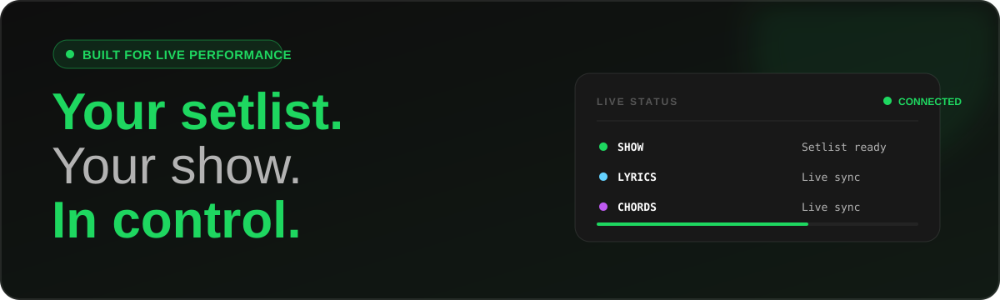

<h1 align="center">
  
</h1>

  <strong>Setlists, transporte, letras y acordes en vivo para REAPER.</strong>

  <a href="README.md">English</a> ·
  <a href="README.es.md"><strong>Español</strong></a> ·
  <a href="https://reaset.app">Sitio web</a> ·
  <a href="docs/USER_GUIDE.es.md">Guía de usuario</a> ·
  <a href="CHANGELOG.md">Changelog</a>

  

  Uso gratuito · macOS · Windows · Linux

## Hecho para el escenario

**ReaSet transforma las regiones de REAPER en un espacio de trabajo enfocado en actuaciones en vivo.** Arma setlists, controla el transporte, sigue las secciones de cada canción y muestra letras y acordes sincronizados desde cualquier navegador de tu red local.

| **Tu show, organizado** | **Tu actuación, protegida** | **Tu banda, conectada** |
|---|---|---|
| Setlists ilimitados guardados junto al proyecto, orden por arrastre y secciones anidadas. | Auto-stop armado, Stop Hold, modos queue/auto, loops y MIDI Init. | Live View, letras, acordes y sincronización Director/Player de solo lectura. |

> [!TIP]
> ¿Quieres conocerlo antes de instalar? Visita **[reaset.app](https://reaset.app)** para ver el recorrido visual completo.

## Funciones destacadas

- **Biblioteca junto al proyecto** — los setlists viven en `<proyecto>/reaset/setlists/`, viajan con el `.rpp` y son archivos JSON legibles.
- **Transporte consciente del show** — reproduce, detén, prepara, encadena, salta y repite regiones sin salir de la interfaz.
- **Secciones de canción** — las subregiones muestran sección activa, progreso, siguiente sección y comportamiento individual.
- **Letras y acordes** — paneles sincronizados desde tracks dedicados y las notas de ítems de REAPER.
- **Vistas para el escenario** — Live View a pantalla completa, overlay Canvas e instancias Player de solo lectura.
- **Diseñado para touch** — vistas lista/cuadrícula, MIDI Learn y protección contra detenciones accidentales.

## Instalación

### Recomendada — ReaBoot

  

ReaBoot instala ReaPack cuando hace falta, registra el script unificado `Reaset.lua` y coloca los archivos web en `reaper_www_root`. También puede instalar las herramientas opcionales de ReaSet, ReaImGui y la extensión SWS recomendada.

> [!IMPORTANT]
> ReaBoot no cambia las preferencias de REAPER. Después de instalar, ejecuta **Reaset** una vez desde **Actions → Show action list** y configúralo como Startup Action si quieres que esté disponible automáticamente.

<strong>Instalación manual</strong>

1. Copia `ReaSet.html` y `Sortable.min.js` al `reaper_www_root` de REAPER.
2. Carga `Reaset.lua` desde **Actions → ReaScript: Load…**.
3. Ejecuta **Reaset** una vez y, opcionalmente, configúralo como Startup Action.
4. Activa REAPER Web Remote y abre `http://localhost:8080/ReaSet.html`.

Consulta la [guía de instalación completa](docs/USER_GUIDE.es.md#6-instalación) para ver rutas por plataforma y solución de problemas.

## Inicio rápido

1. **Prepara la línea de tiempo** — crea una región de REAPER por canción.
2. **Inicia el puente** — ejecuta `Reaset` desde la lista de acciones.
3. **Abre ReaSet** — carga `http://localhost:8080/ReaSet.html` y pulsa **Sync**.
4. **Arma el show** — crea un setlist, agrega canciones y ordénalas arrastrando.
5. **Sal a escena** — prepara una canción, pulsa Play y cambia a Live View cuando lo necesites.

Las letras y los acordes son opcionales. Para usarlos, crea tracks que coincidan con `lyrics` y `chords`, y coloca el texto en las notas de ítems.

## Requisitos

| Obligatorio | Opcional |
|---|---|
| REAPER, un navegador moderno y un proyecto con regiones | SWS para leer Item Notes y usar transporte armado preciso |
| `ReaSet.html`, `Sortable.min.js` y `Reaset.lua` | ReaImGui para Lyrics Tapper |
| REAPER Web Remote activado | Un teléfono o tablet en la misma red |

## Herramientas incluidas

| Herramienta | Para qué sirve |
|---|---|
| **Lyrics Tapper** | Crea ítems temporizados de letras/acordes mientras suena la canción. |
| **ReaSet Diagnose** | Inspecciona tracks, Item Notes, selección del puente y disponibilidad de SWS. |
| **Library Doctor** | Audita setlists y la ruta navegador → script → disco. |
| **Text to MIDI Bitmap** | Convierte texto en datos bitmap MIDI para flujos compatibles. |

Las herramientas son opcionales y pueden seleccionarse en el instalador de ReaBoot. Consulta [Herramientas en la guía](docs/USER_GUIDE.es.md#5-herramientas).

## Documentación

| Recurso | Contenido |
|---|---|
| **[Guía de usuario](docs/USER_GUIDE.es.md)** | Configuración completa, manual, comandos de regiones, MIDI Learn y troubleshooting. |
| **[User guide](docs/USER_GUIDE.md)** | Manual completo en inglés. |
| **[Mantenimiento de ReaBoot](docs/REABOOT.md)** | Estructura de paquetes y procedimiento de releases. |
| **[Changelog](CHANGELOG.md)** | Historial de versiones y cambios técnicos. |
| **[Roadmap](ROADMAP.md)** | Dirección planificada para ReaSet. |
| **[Contribuir](CONTRIBUTING.md)** | Reglas y acuerdo de licencia para contribuciones. |

## Apoya el proyecto

Si ReaSet hace tus shows más seguros o sencillos, puedes apoyar su desarrollo:

## Créditos y licencia

ReaSet se inspiró en [ReaSetlistManager](https://github.com/suckyble/ReaSetlistManager) de `suckyble`; su flujo de letras/acordes tomó referencias de los [scripts de REAPER de X-Raym](https://github.com/X-Raym/REAPER-ReaScripts/tree/master/Web%20Interfaces), y el ordenamiento usa [SortableJS](https://sortablejs.github.io/Sortable/).

ReaSet v3.0+ es **propietario y de uso gratuito**. Puedes usarlo comercialmente, en cualquier cantidad de equipos, y compartir copias sin modificar. Venderlo o distribuir versiones modificadas requiere autorización escrita. Las versiones hasta v2.x mantienen GPL v3. Consulta [`LICENSE`](LICENSE) y [`docs/RELICENSING.md`](docs/RELICENSING.md).

---

  <strong>Tu setlist. Tu show. En control.</strong> 
  <a href="https://reaset.app">reaset.app</a>

