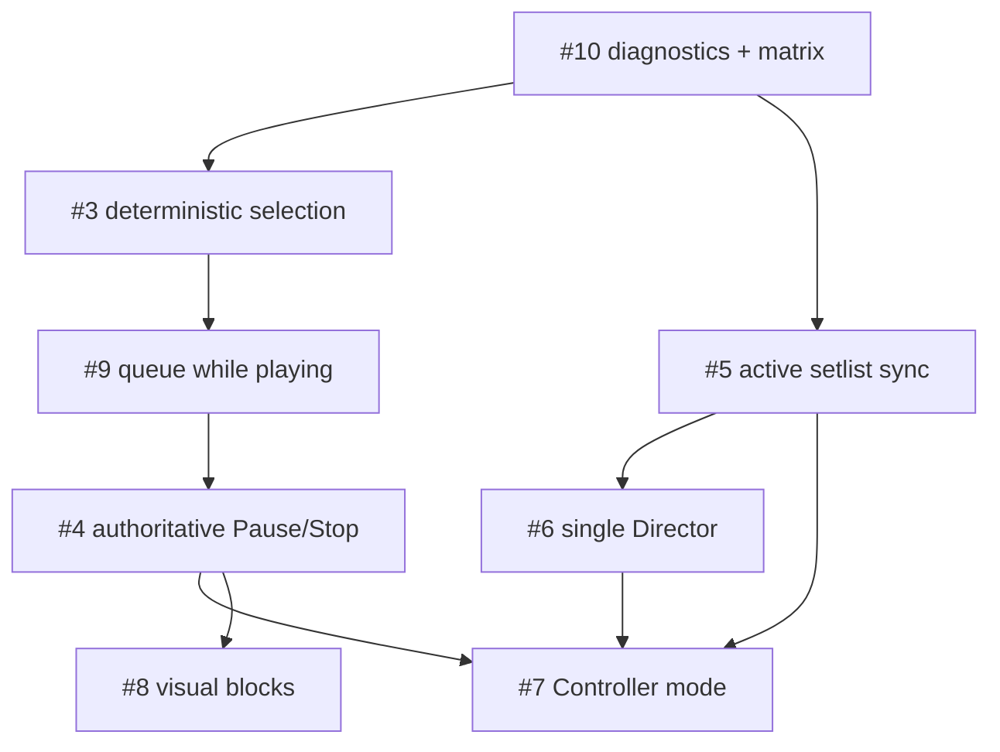

# Stage Reliability Implementation Plan

Epic: #2  
Issues: #3, #4, #5, #6, #7, #8, #9, #10  
Integration branch: `dev/stage-reliability`

## Scope and constraints

This work preserves the existing `ReaSet.html` + `Reaset.lua` + REAPER Web
Remote architecture. It does not introduce a framework, external backend, LAN
discovery, or a persisted playback-block entity. NativeLoop, MIDI Init,
Auto-Stop, lyrics, chords, sections, and project-local setlists remain intact.

The repository has one broad browser implementation file. Analysis can run in
parallel, but changes to `ReaSet.html` must be integrated serially and reviewed
by behavior, not by accepting conflicts mechanically.

## Current transport map

### Observed state and current intent

- `currentPos` is overwritten by every `TRANSPORT` reply and is observed
  REAPER state. It can be stale relative to a just-issued user command.
- `isPlaying` is also derived from `TRANSPORT`; paused and stopped currently
  collapse to the same false value.
- `activeRegion` is currently a local variable recomputed in
  `updatePlaybackUI()` from `currentPos`. It is observed state, not intent.
- `queuedRegion` exists globally and is used by section/song boundary logic.
  It is currently assigned only when Queue Mode is enabled while playing.
- There is no durable `selectedRegion`. `_playIntent` only masks the MIDI Init
  pre-roll display artifact and is not a complete idle-selection model.

The target model is explicit:

```text
currentPos      observed REAPER cursor/play position
activeRegion    top-level region inferred from currentPos
selectedRegion  explicit idle/paused user cue and next Play target
queuedRegion    explicit next-song intent while playing
```

### Play

- `playRegion(start, id)` is the row/section entry point. Today it calls
  `seekManualTransport(..., true)` whenever stopped, so tapping a row sends
  `SET/POS;<Play>` and starts playback. While playing, Queue Mode OFF also
  seeks/restarts immediately.
- `togglePlay()` sends Pause when playing. When idle, it uses `currentPos`; if
  no containing region is found, it calls `playRegion(displayList[0])`.
  This is the stale-poll wrong-song fallback described by #3.
- `seekManualTransport()` combines `SET/POS` and action `1007` when
  `startWhenStopped` is true. It also forces a hard restart while playing when
  Smooth Seek is disabled.
- Main footer, Live View, Canvas, keyboard, and MIDI ultimately call these
  helpers, but some navigation paths call `cueRegion()` directly.

### Pause and Stop

- Pause is REAPER action `1008`, sent directly by `togglePlay()` and by
  section `+PAUSE` automation.
- Stop is action `1016`. `smartStop()` stops and schedules a cursor rewind via
  an uncancellable 150 ms timeout.
- special `STOP` markers stop and schedule a next-song cursor move after
  100 ms.
- per-song `stopAfter` and Auto-Stop defer their post-stop cursor positioning
  through `_pendingCuePos`, consumed by the first stopped `TRANSPORT` reply.
- `wait` schedules delayed `SET/POS` and Play callbacks without a generation
  token, so manual Stop cannot currently invalidate them.
- `_playRegionLocked`, `_endOfRegionLocked`, `_lastRegionEndTrigger`,
  `_lastTransitionTriggerPos`, `_lastPauseTriggerPos`, and reconnect guards are
  independent partial race guards. None expresses “the last manual command
  wins” across all automatic writers.

### SET/POS, callbacks, and stale polling

`SET/POS` is emitted by manual selection/navigation, skipped-song handling,
NativeLoop teardown/JS fallback, special markers, sub-region loop/transition,
explicit queue consumption, song loop/continue, Stop repositioning, Wait, and
Auto-Stop post-stop cueing. All outbound transport writes need a diagnostic
reason; automatic writes need a common manual-intent guard.

The `TRANSPORT` poll runs every 33 ms. `_lastTransportTs` supports position
extrapolation, while `_resyncGuardUntil` suppresses automatic writes after a
reply gap. Fresh user commands must remain allowed during that reconnect
guard. Stale replies must update observed UI state but must not erase explicit
selection or authorize an old automatic callback.

### Auto-Stop, Queue, NativeLoop, and MIDI Init

- Browser code publishes `autoStopStart`, `autoStopEnd`, and `autoStop=on`.
  `Reaset.lua` arms REAPER's loop range with repeat off and publishes
  `autoStopArmed=1`; the browser fallback sends Stop only when arming is absent.
- Queue consumption currently precedes per-song Stop/Wait handling at the song
  boundary. #9 requires effective Stop/Wait boundaries to win: a queued target
  becomes the idle selection and must not auto-start across a block boundary.
- NativeLoop owns the same REAPER time selection and repeat state as Auto-Stop.
  Its Lua arbitration and browser fallback must not be removed or routed
  through a behavior-changing abstraction.
- MIDI Init must occur only on explicit Play. Cueing while idle positions the
  cursor at the exact region start; Play may apply the existing 5 ms pre-roll.

## Current synchronization map

```text
Director change
  -> currentSetlistName / displayList
  -> saveCurrentState() / _syncPushSoon()
  -> _syncBuildPayload()
  -> chunked SET/EXTSTATE + setlistRev
  -> Reaset.lua sync_tick()
  -> reaset_setlist_sync.json
  -> remote _syncPullNow()
  -> _syncApplyPayload()
  -> displayList + renderSetlist() + updatePlaybackUI()
```

### Identified breaks

- `currentSetlistName` is already in `_syncBuildPayload()`, but
  `changeSetlist()` only updates localStorage and calls `syncRegions()`; the
  push is an indirect consequence of the later `saveCurrentState()` and then
  waits for the 1 second debounce. Combined with 4 second follower polling,
  worst-case propagation is approximately 5 seconds.
- `_syncApplyPayload()` reorders objects from the receiver's current
  `displayList` before changing `currentSetlistName`. It does not first build
  the named set from the project-local library, so a valid remote name can be
  paired with the old set's rows.
- remote apply calls `saveCurrentState()`. Mode checks prevent Player push, but
  the function still writes the received set into local state and couples
  “apply” to persistence/publishing side effects.
- Player polling is 4 seconds, above the approximately 1 second target.
- `_syncLastAppliedRev` is session-local and Director revisions restart at
  zero. Revision comparison must account for a per-writer epoch/instance, and
  boot/reconnect must allow the current Director snapshot to beat stale
  localStorage. Fetch/apply also needs single-flight ordering so an older HTTP
  response cannot land last.
- chunk requests are independent. A new revision can be observed while old,
  non-empty chunk keys still exist, allowing Lua to assemble mixed generations.
  A push token/generation must bind chunks and commit before the shared file is
  replaced.
- Controller must use the same receiver path as Player and never publish
  structural state or emit transport commands merely because sync resumed.
- `stop`/`wait` live in browser-local overrides and global Auto-Stop is also
  local; the current payload only carries `chain/skipped/loop`. The structural
  end-state needed for follower playback-block rendering must be included in
  the canonical shared payload and applied before rendering. This does not
  create a persisted Block entity.

`Reaset.lua` already uses `setlistRev` as the completion signal, retries
partially arrived chunks, and writes the shared envelope. No Lua change is
planned for #5 unless tests expose a bridge-level failure.

## Current Director/session map

- A browser-local `instanceId` identifies the device.
- a Director writes `directorHeartbeatId`, `directorHeartbeatTs`, and
  `directorHeartbeatName` every 4 seconds.
- all devices poll those keys every 2 seconds.
- `_dcForeignActive()` treats a foreign heartbeat as live for 9 seconds after
  its timestamp value was observed changing.
- `chooseMode('director')` currently warns and permits continuation.
- a stored Director bypasses acquisition checks on boot and starts heartbeats
  immediately.
- `_dcWatchConflict()` only displays a banner; it does not revoke write
  authority.

The audit found a real browser-only race: two devices can both observe an empty
heartbeat, both enter Director, and then alternate last-write-wins values. A
shared localStorage `instanceId` also makes two tabs on one browser invisible to
the current detector. This justifies minimal lease arbitration in `Reaset.lua`:
the browser requests ownership, Lua grants one owner/epoch with a monotonic
clock/TTL, and write authorization fails closed until the browser observes its
own valid lease. Explicit takeover increments the epoch and the old owner loses
write authority. No LAN discovery is introduced. TTL/background behavior and
simultaneous acquisition still require physical-device validation.

## Render and playback-block map

- `renderSetlist()` builds top-level grid cards or list-mode `song-container`
  elements, then nests expanded section rows inside the container.
- `getSongEnd(song)` resolves stored `stop`, `wait`, `continue`, or `auto`.
- `songEndVisual(song)` resolves `auto` against the global Auto-Stop toggle for
  presentation.
- visual block starts will be derived once per visible top-level row from the
  previous relevant visible song's effective end state.
- `continue` attaches the next row; `stop` and `wait` create a gap; `auto`
  follows Auto-Stop.
- hidden skipped rows are excluded from the “previous visible song” chain.
  Visible skipped rows stay in layout but do not define playback continuation;
  the previous non-skipped song defines the next non-skipped block boundary.
- expanded sections never receive block-start spacing. Reorder, end-state,
  Auto-Stop, skip visibility, sync apply, and mode changes already rerender and
  must recompute the derived classes.
- follower views depend on Track B synchronizing the canonical effective inputs
  (`endState`/wait data and Auto-Stop), otherwise Director and Player/Controller
  could draw contradictory blocks.

## Central permissions target

| Capability | Director | Controller | Player |
|---|---:|---:|---:|
| Play/Pause/Stop | yes | yes | no |
| Cue/queue/Next/Previous | yes | yes | no |
| Edit/reorder/end/skip/loop | yes | no | no |
| Select/publish named setlist | yes | follow only | follow only |
| Import/create/delete/rename | yes | no | no |
| Local display/lyrics/chords | yes | yes | yes |

The implementation will centralize `canControlTransport()`,
`canEditSetlist()`, and `canPublishSetlist()`. UI visibility is secondary;
every mutation entry point and the outbound command choke point remain gated.
Controller will allow only an explicit transport-command category, not
arbitrary `SET/EXTSTATE` writes.

## Diagnostics

`?diag=transport` will enable a bounded state-change/ring-buffer logger with:

- timestamp and event/source;
- mode and `instanceId`;
- `isPlaying`, `currentPos`, active region;
- `selectedRegion`, `queuedRegion`;
- command and reason;
- `currentSetlistName`, sync revision/Director instance;
- manual transport intent/guard and transition generation.

Transport-changing commands will pass through a thin traced-send helper.
Normal polling will not be logged every 33 ms; only changes and relevant
command/guard/sync events will be recorded.

## Dependency graph



`#8` can be developed in isolation after the effective end-state rule is
confirmed, but it is integrated after transport/session/controller. `#6` can
be implemented after the sync audit without waiting for transport, but final
write-authority checks are reviewed together with `#7`.

## Tracks, branches, and ownership

| Track | Branch | Issues | Files/areas |
|---|---|---|---|
| A Transport | `fix/stage-transport` | #3 -> #9 -> #4 | `ReaSet.html`: state, transport helpers, reply handling, boundary callbacks, row/Live/Canvas/MIDI entry points; focused tests/docs only |
| B Sync | `fix/active-setlist-sync` | #5 | `ReaSet.html`: setlist selection, payload/apply/polling/boot; `Reaset.lua` only if bridge evidence requires it |
| C Session | `fix/single-director` | #6 | `ReaSet.html`: mode boot, lease requests/observations and write authorization; `Reaset.lua`: minimal owner/epoch/TTL arbiter; user guide notes |
| D Controller | `feat/controller-mode` | #7 | `ReaSet.html`: mode UI/i18n, permission helpers/gates, editing controls, polling; `docs/USER_GUIDE.md` |
| E Visual blocks | `feat/setlist-block-spacing` | #8 | `ReaSet.html`: centralized effective-end/block-start helpers, list/grid classes/CSS |
| F QA | `test/stage-diagnostics` | #10 | `ReaSet.html`: opt-in logger/traced transport writes; `docs/STAGE_TEST_MATRIX.md`; static test harness where feasible |

## Parallel work and serialized integration

Safe immediately after this plan:

- Track F: diagnostic primitives, matrix, static harness.
- Track A: state-machine implementation on its isolated branch.
- Track B: active named-set synchronization on its isolated branch.
- Track E: derived visual spacing on its isolated branch.
- Track C: heartbeat acquisition analysis/implementation can proceed, but is
  integrated after #5.

Track D implementation waits for the integrated contracts from A, B, and C.
Because A/B/C/E/F all touch `ReaSet.html`, their commits are cherry-picked in
the required order and conflicts are resolved by reviewing call paths and
state transitions:

```text
#10 -> #3 -> #9 -> #4 -> #5 -> #6 -> #7 -> #8
```

## Verification and stopping point

Cloud/static verification will cover syntax, policy gates, state transitions
that can be modeled without REAPER, documentation, and existing packaging
tests when their dependencies are available. The existing environment does
not include `pytest`; this is recorded rather than reported as a passing test.

No issue requiring REAPER/Mac/phone is considered validated in the cloud.
After implementation and static checks, issues are marked:

```text
IMPLEMENTED — AWAITING REAL DEVICE TEST
```

The handoff will identify exact branch/commit, files, REAPER/SWS/Web Remote
setup, repeatable steps, expected results, and the `?diag=transport` logs to
return on failure. Epic #2 remains open until the physical matrix passes.
